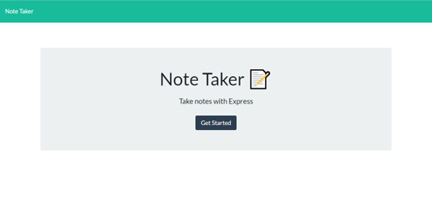
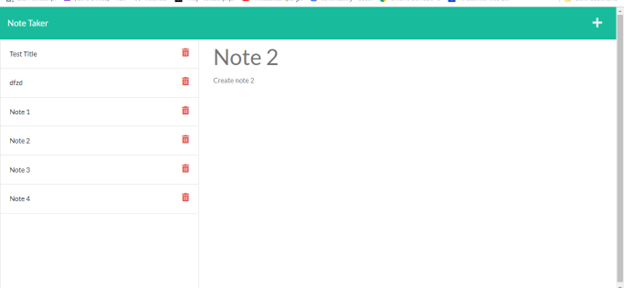

  ## Title
  Note-Taker-by-Reem

  
   
    

## Task
To create an application called Note Taker that can be used to write and save notes. This application will use an Express.js back end and will save and retrieve note data from a JSON file.

The application’s front end has already been created. My job was to build the back end, connect the two, and then deploy the entire application to Heroku.

 [the starter code](https://github.com/coding-boot-camp/miniature-eureka).

  
  ## Table-of-Contents
  
  1. [Title](#title)
  2. [Description](#description)
  3. [Installation](#Installation)
  4. [Usage](#usage)
  5. [Contribute](#contribute)
  6. [Tests](#tests)
  7. [License](#license)
  8. [Github](#github)
  9. [Questions](#email)

  ## Description
  This application called Note Taker that can be used to write and save notes. This application will use an Express.js back end and will save and retrieve note data from a JSON file.

  ## Installation
  
  To install this project first 'git clone' the repo and then install all the required npm packages like filesystem and framework called express.

  ## Usage

  This application is deployed on Heroku platform. The users who wish to make notes can access the application from deployed website. To start using the application, open your browser and go to

http://localhost:3002/

  ## Contribute
  I have used the starter code for build this application. All contributions are welcomed. Please discuss before you make any changes.
  
  ## Tests
  
  Tested the application using Insomnia

  ## License
  
    This project is covered under the following license:
    
   
    
    

  ## GitHub
  [GitHub](https://github.com/ReemMDA0909)
  
  ## Email
  reem.mda0909@gmail.com
  
## User Story

AS A small business owner
I WANT to be able to write and save notes
SO THAT I can organize my thoughts and keep track of tasks I need to complete

## Programs used

- Heroku
- Node.js
- Express.js
- JavaScript
- Insomnia

## Screenshots

## Demo

https://drive.google.com/file/d/17Y0XBqxTSu0GtzdC8M4JxFWjOv6JG6xd/view?usp=sharing

## Submission Links

* The URL of the functional, deployed application: https://notetaker-by-reem.herokuapp.com/

* The URL of the GitHub repository: https://github.com/ReemMDA99/NoteTaker-by-Reem

* A demo video clip of application: https://drive.google.com/file/d/17Y0XBqxTSu0GtzdC8M4JxFWjOv6JG6xd/view?usp=sharing